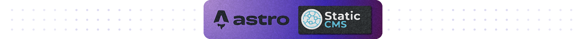
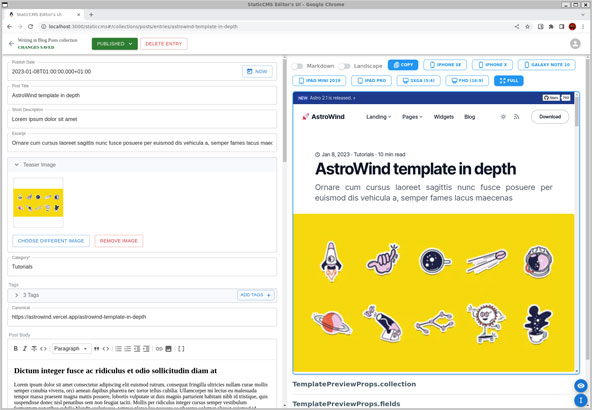

<p style="text-align: center;">
Add <a href="https://www.staticcms.org/">Static CMS</a> frontend
to your <a href="https://astro.build/">🚀 Astro</a> project and simplify the content and assent management tasks.
<br/><br/>🌱 <a href="https://www.staticcms.org/">Static CMS</a> is a fork of <a href="https://www.netlify.com/blog/netlify-cms-to-become-decap-cms/">Decap CMS aka Netlify CMS</a> focusing on the core product over adding massive, scope expanding, new features.
</p>

## What is this?

This is an integration
of [Static CMS](http://staticcms.org) [git based](https://www.staticcms.org/docs/backends-overview) headless content
management frontend with [Astro](https://astro.build/) static site generator. You maintain the assets and edit the
Markdown and MDX content (🚨Note: _It's not an editor for you \*.astro files_) together with a preview pane in browser
instead of using e.g. [Visual Studio Code and JetBrains IDEs](https://docs.astro.build/en/editor-setup/). While
starting [Astro in preview mode](https://docs.astro.build/en/tutorial/1-setup/2/#run-astro-in-dev-mode)
the [Static CMS](http://staticcms.org) frontend is also available through http://localhost:3000/staticcms.

> 👀 This integration simplifies your [Astro](https://astro.build/) workflow in two aspects:
>
> 1. Automatically enabling the [Static CMS](http://staticcms.org) frontend
     while [Astro is in preview mode](https://docs.astro.build/en/tutorial/1-setup/2/#run-astro-in-dev-mode), and
     disabling the integration while building the static site.
> 2. The default preview pane from [Static CMS](http://staticcms.org) is not suitable for [Astro](https://astro.build/),
     so this integration provides its own default preview pane which works with [Astro](https://astro.build/) generated
     pages.

## How does it work?

Because of the nature of [Astro](https://astro.build/) as static site generator, the usage
of [Static CMS](http://staticcms.org) makes only sense during the preparation for a new static site.
So [Static CMS](http://staticcms.org) is _not_ integrated in your static site build. [Static CMS](http://staticcms.org)
is enabled
if [Astro is running in the preview mode](https://docs.astro.build/en/tutorial/1-setup/2/#run-astro-in-dev-mode) only.



In [Astro preview mode](https://docs.astro.build/en/tutorial/1-setup/2/#run-astro-in-dev-mode) every change is detected
while publishing in [Static CMS](http://staticcms.org) frontend. [Astro](https://astro.build/) rebuild the affected page
in background and the preview pane is updated with the new result.

> 💡 This may improve in the future
> if [Container API: render components in isolation](https://github.com/withastro/roadmap/discussions/462)
> and/or [Incremental build support](https://github.com/withastro/roadmap/discussions/237) makes progress. Check
> the [Astro roadmap](https://github.com/orgs/withastro/projects/11) for future releases.

## Use case

Using [Static CMS](http://staticcms.org) simplifies the maintenance of your content and assets in a browser based
frontend. To take advantage of [Static CMS](http://staticcms.org) in combination with [Astro](https://astro.build/),
your workflow typically looks like this:

1. Start [Astro in the preview mode](https://docs.astro.build/en/tutorial/1-setup/2/#run-astro-in-dev-mode), so we are
   able to preview our changes later in the Static CMS editor view: `pnpm run dev`
2. Open the default URL http://localhost:3000/staticcms in your browser to update your content and assents.
3. As soon you have done the work, you would stop
   the [Astro preview mode](https://docs.astro.build/en/tutorial/1-setup/2/#run-astro-in-dev-mode) and build your new
   static site: `pnpm run build`
4. Publish your new static site.

## Installation

> 👉 You can also use `npm` or `yarn` but `pnpm` is the default package manager for [Astro](https://astro.build) so we
> use it instead.

> 👉 The screenshot above uses the [AstroWind theme](https://astro.build/themes/details/astrowind/). So if you want to
> experiment with this integration start with installing
> the [AstroWind theme](https://astro.build/themes/details/astrowind/) first before continue with this tutorial:
>
> ```shell
> git clone https://github.com/onwidget/astrowind.git
> cd astrowind
> ```

> 💡 Only [Astro themes](https://astro.build/themes) are suitable as starting point because we need Markdown or MDX files
> for content creation. [Static CMS](http://staticcms.org) support only those file formats. Few examples
> of themes from the Astro repository witch are suitable to start with experimenting:
>
> - [AstroWind theme](https://astro.build/themes/details/astrowind/)
> - [Creek theme](https://astro.build/themes/details/creek/)

1. Install the required modules within your [Astro](https://astro.build/) project folder:
   ```shell
   pnpm i -D @staticcms/core @staticcms/proxy-server @grewety/astro-static-cms
   ```
2. Optional: If you want to [authenticate users with Netlify Identity](https://docs.netlify.com/visitor-access/identity/) install also:
   ```shell
   pnpm i -D netlify-identity-widget
   ```
   > Demo: https://identity.netlify.com/
3. Modify the configuration in `astro.config.mjs` file and add the [Static CMS](http://staticcms.org) integration 
   from `@grewety/astro-static-cms` module.
   For [Static CMS](http://staticcms.org) it's also mandatory to resolve the routing of paths in Markdown and MDX files using `~`, so
   we extend the `vite` section in the `astro.config.mjs` file:

   ```js
   import { defineConfig } from "astro/config";
   import StaticCMS from "@grewety/astro-static-cms";

   export default defineConfig({
     integrations: [
       StaticCMS({
         // Overview of Static CMS configuration options: https://www.staticcms.org/docs/configuration-options
         config: {
           media_folder: "src/assets/media",
           // Overview of Static CMS collections configuration: https://www.staticcms.org/docs/collection-overview
           collections: [
             // Example based on blog post collection of AstroWind theme
             {
               name: "posts",
               label: "Blog Posts",
               folder: "src/content/post",
               create: true,
               delete: true,
               fields: [
                 // Widgets define the data type and interface for entry fields.
                 // Static CMS comes with several built-in widgets:
                 // https://www.staticcms.org/docs/widgets
                 // Note: Please see the whole fields example for AstroWind theme
                 // at the end of this tutorial.
               ],
             },
           ],
         },
       }),
     ],
     vite: {
       resolve: {
         alias: {
           "/~": path.resolve(__dirname, "./src"), // <= Added for Static CMS
         },
       },
     },
   });
   ```

## Configuration

> 💡 Overview of [Static CMS](http://staticcms.org) configuration options: https://www.staticcms.org/docs/configuration-options

> 💡 Overview of [Static CMS](http://staticcms.org) collections configuration: https://www.staticcms.org/docs/collection-overview

> 💡 Overview of [Static CMS](http://staticcms.org) built-in widgets: https://www.staticcms.org/docs/widgets

You can pass an options object to the integration to configure how it behaves.

### 👉 editorPath

- **Option**: `editorPath: ""`
- **Default**: `/staticcms`
- **Type/Definition**: `string` (URI); Have to start with a `/` (slash).
- **Description**: Determines the path where to find the [Static CMS](http://staticcms.org) editor's UI in the URL.

### 👉 config

- **Option**: `config: {}`
- **Default**: `undefined`
- **Type/Definition**: [Static CMS configuration options](https://www.staticcms.org/docs/configuration-options)
- **Description**: Configuration of [Static CMS](http://staticcms.org) in general.

#### 👉 config.backend

- **Option**: `config: { backend: {} }`
- **Default**: `{ name: "proxy", proxy_url: "http://localhost:8081/api/v1/" }`
- **Type/Definition**: [Static CMS backend configuration](https://www.staticcms.org/docs/backends-overview), especially [Local Backend](https://www.staticcms.org/docs/local-backend) if you want to change the default port `8081`
- **Description**: Where to find the git repository and the right branch. To set your own backend, you have to change at least the `config.backend.base_url`.

#### 👉 config.media_folder

- **Option**: `config: { media_folder: "" }`
- **Default**: If not specified the implementation search automatically for the existence of following folders:
  1.  `src/assets/media`
  2.  `src/assets/images`
  3.  `public/assets/media`
  4.  `public/assets/images`
  5.  `src/assets`
  6.  `public/assets`
  7.  `assets/images`
  8.  `assets/media`
  9.  `assets`
  10. `public`
- **Type/Definition**: [Static CMS configuration options](https://www.staticcms.org/docs/configuration-options#media-folder)
- **Description**: From the documentation: The `config.media_folder` option specifies the folder path where uploaded files should be saved, relative to the base of the repository.

#### 👉 config.collections

- **Option**: `config : { collections: [] }`
- **Default**: `undefined`
- **Type/Definition**: [Static CMS collections configuration](https://www.staticcms.org/docs/collection-overview)
- **Description**: Your define for every front matter of an Markdown or MDX file you will edit in [Static CMS](http://staticcms.org) a corresponding collection. There have to be at least one.

### 👉 previewTemplate

- **Option**: `previewTemplate: []`
- **Default**: `[~config.collections.name~, 'DefaultPreviewTemplate', 'import DefaultPreviewTemplate from "astro-static-cms/StaticCMSPreviewTemplate";']` For any collection without an individual preview template, the default template will be applied.
- **Type/Definition**: A list of `type PreviewTemplateRuntime = [collection_name: string, component: React.FC<TemplatePreviewProps>, import_component: string]`. The definition of [TemplatePreviewProps](https://github.com/StaticJsCMS/static-cms/blob/main/packages/core/src/interface.ts#L315) is part of Static CMS API.
- **Description**: If you want that your Astro page is displayed in a different way in the preview pane of Static CMS, use your own React component here. Your React component will be rendered within an `iframe` by [react-frame-component](https://www.npmjs.com/package/react-frame-component) so any dependency needs to be pre-packed. Check the implementation in https://github.com/StaticJsCMS/static-cms/tree/main/packages/core/src/components/Editor for further details.

### 👉 previewStyles

- **Option**: `previewStyles`
- **Default**: `undefined`
- **Type/Definition**: A list of `type CustomPreviewStyles { href?: string[]; css?: string[]; local_import?: string[]; }`
- **Description**: Include or inject your CSS data in the header of the preview page/pane.
  - The array of `href` will be used in `<link>`.
  - The `css` array will be injected in `<script>` block.
  - The `local_import` can be a file or module which can be imported by Vite/Rollup and its default export is a CSS string which will be injected in `<script>` block.

### 👉 injectBeforeInitStaticCMS

- **Option**: `injectBeforeInitStaticCMS`
- **Default**: `undefined`
- **Type/Definition:** A list of `type injectJavaScriptCode { js_code: string; }`
- **Description:**: The corresponding implementation where this code is injected looks like:
    ```js
    import initStaticCMS from "@grewety/astro-static-cms/StaticCMSEditorUIRoute";
    const startStaticCMS = true;
    const initStaticCMSParams = {
      config: {...},
      previewStyles: [,,,],
      previewTemplates: [,,,],
      minLogLevel: logger.settings.minLevel,
    };
    ${injectBeforeInitStaticCMS.map((entry) => entry.js_code).join("\n")} // <= The JS code will be injected here
    startStaticCMS && initStaticCMS(initStaticCMSParams);
    ```
  This module provide following helper implementation which can be injected:
  - If you want to [authenticate users with Netlify Identity](https://docs.netlify.com/visitor-access/identity/): `enableNetlifyIdentityWidget(editorPath: string = "/staticcms"): string` inject [Netlify’s Identity Widget](https://github.com/netlify/netlify-identity-widget) at your `editorPath` to enable authentication.

### 👉 minLogLevel

- **Option**: minLogLevel
- **Default**: `4`
- **Type/Definition**: `number`, 0:silly, 1:trace, 2:debug, 3:info, 4:warn, 5:error, 6:fatal
- **Description**: Set the minimum reporting level we use to inform about the execution of this integration.

### Example configuration snippet of an astro.config.mjs

```js
import StaticCMS, { enableNetlifyIdentityWidget } from "@grewety/astro-static-cms";

export default defineConfig({
  integrations: [
    StaticCMS({
      minLogLevel: 2, // DEBUG
      editorPath: '/localedit', // <= Add our favorit path
      config: { // <= https://www.staticcms.org/docs/configuration-options
        backend: { // <= This is the default if not other specified
          name: "proxy",
          proxy_url: "http://localhost:8081/api/v1/"
        },
        media_folder: 'src/assets', // << Where to find/upload the media files
        collections: [{ // <= https://www.staticcms.org/docs/collection-overview
          name: "coll_a",
          ...
        }, {
          name: "coll_b",
          ...
        }],
      },
      previewStyles: {
        css: [".frame-content { background-color: #fef; }"],
        local_import: ["@grewety/astro-static-cms/StaticCMSPreviewTemplate/Default.css"]
      },
      injectBeforeInitStaticCMS: [enableNetlifyIdentityWidget('/localedit')],
    }),
   ],
});
```

## AstroWind theme example configuration

The fields per collection describe the _front matter_ of the Markdown or MDX files. The corresponding Markdown files from [AstroWind theme](https://astro.build/themes/details/astrowind/) we are using for this example configuration are:

- For **name: 'posts'** the front matter from [astrowind-template-in-depth.md](https://raw.githubusercontent.com/onwidget/astrowind/main/src/content/post/astrowind-template-in-depth.md) looks like:
  ```markdown
  ---
  publishDate: 2023-01-08T00:00:00Z
  title: AstroWind template in depth
  description: Lorem ipsum dolor sit amet
  excerpt: Ornare cum cursus laoreet sagittis nunc fusce posuere per euismod
  image: ~/assets/images/stickers.jpg
  category: Tutorials
  tags:
    - astro
    - tailwind css
    - front-end
  canonical: https://astrowind.vercel.app/astrowind-template-in-depth
  ---
  ```
  The corresponding collection looks like:
  ```js
  collections: [
    // Define a blog post collection based on https://astro.build/themes/details/astrowind/
    {
      name: "posts",
      label: "Blog Posts",
      folder: "src/content/post",
      create: true,
      delete: true,
      fields: [
        /**
         * Widgets define the data type and interface for entry fields.
         * Static CMS comes with several built-in widgets.
         * (https://www.staticcms.org/docs/widgets)
         */
        {
          name: "publishDate",
          widget: "datetime",
          label: "Publish Date",
        },
        {
          name: "title",
          widget: "string",
          label: "Post Title",
        },
        {
          name: "description",
          widget: "string",
          label: "Short Description",
        },
        {
          name: "excerpt",
          widget: "string",
          label: "Excerpt",
        },
        {
          name: "image",
          widget: "image",
          label: "Teaser Image",
        },
        {
          name: "category",
          widget: "string",
          label: "Category*",
        },
        {
          name: "tags",
          widget: "list",
          label: "Tags",
          summary: "{{fields.tag}}",
          fields: [
            {
              name: "tag",
              label: "Tag",
              widget: "string",
            },
          ],
        },
        {
          name: "canonical",
          widget: "string",
          label: "Canonical",
        },
        {
          name: "body",
          widget: "markdown",
          label: "Post Body",
        },
      ],
    },
  ];
  ```

## Development

> 🙋 If you want to contribute to this project, please read also [CONTRIBUTING.md](rules/CONTRIBUTING.md).

### Testing

The test environment is done with [Playwright](https://playwright.dev/) in `tests` subdirectory.

Instructions how to set up your development environment for testing please refer to
[Install system dependencies](https://playwright.dev/docs/browsers#install-system-dependencies).

## 👮Project Steward

- [Raphael Bossek](https://github.com/RaphaelBossek)

## Credits

The work of inspired this implementation:
- @delucis (https://github.com/delucis/astro-netlify-cms)
- @markmead (https://github.com/markmead/hyperui)
- https://www.browserstack.com/responsive
- https://responsively.app

## License

[MIT](LICENSE)

Copyright (c) 2023  Raphael Bossek